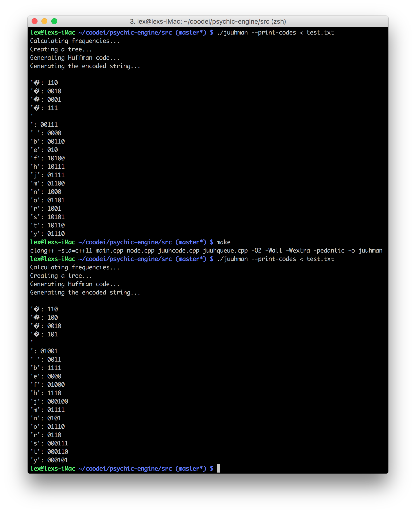

# Testausdokumentti

- Testattu nopeutta ja toimivuutta binääritiedostoilla, tekstitiedostoilla sekä satunnaisdatalla.
- Yksikkötestit testaavat vain oikeaa (toivottua) ulosantia.

#### Nopeus

Erilaisia tiedostoja kokeiltaessa huomattiin, että putki on selvästi suurin pullonkaula ohjelman nopeudelle.

6,2 megatavun tekstitiedosto putkitettuna:
```shell
lex@steve ~/psychic-engine/src (master*) $ time ./juuhman --print-stats < big.txt
Calculating frequencies...
Creating a tree...
Generating Huffman code...
Generating the encoded string...

Original size:	6488666 bytes
Encoded size:	3683091 bytes (56.7619% of original)
./juuhman --print-stats < big.txt  1.39s user 0.06s system 99% cpu 1.455 total
```

Koodiin sisällytettynä:
```shell
lex@steve ~/psychic-engine/src (master*) $ time ./juuhman --print-stats
Calculating frequencies...
Creating a tree...
Generating Huffman code...
Generating the encoded string...

Original size:	6360209 bytes
Encoded size:	3568831 bytes (56.1119% of original)
./juuhman --print-stats  0.21s user 0.04s system 96% cpu 0.260 total
```

Eli noin 4,5 kertaa nopeampi.

Nopeutta voisi myös nostaa reilusti (vaikka kyse onkin millisekunneista) käyttämällä useampaa säiettä. Merkkien määrien sekä koodien laskeminen rinnakkaistuisivat erittäin helposti.

Putken poistamisen ja oman vector-toteutuksen jälkeen saatiin tällaisia tuloksia:
```
lex@lexs-iMac ~/coodei/psychic-engine/src (master*) $ time ./juuhman --encode big.txt -o enc.txt
Calculating frequencies...
Creating a tree...
Generating Huffman code...
./juuhman --encode big.txt -o enc.txt  0.47s user 0.06s system 96% cpu 0.556 total
```


#### JuuhQueue

```shell
lex@steve ~/coodei/psychic-engine/src (master*) $ time ./juuhman --print-stats < big.txt
Calculating frequencies...
Creating a tree...
Generating Huffman code...
Generating the encoded string...

Original size:	6488666 bytes
Encoded size:	3806829 bytes (58.6689% of original)
./juuhman --print-stats < big.txt  1.38s user 0.04s system 99% cpu 1.423 total
```

Oma prioriteettijonon toteutus vaikuttaa yhtä nopealta kuin C++:n standardikirjaston priority_queue. Huomattiin kuitenkin, että erilaisilla heapify-funktioilla tuli erilaisia tuloksia. Pienemmillä merkkijonoilla tosin vain merkkien koodit vaihtoivat paikkaa, mutta koko pysyi silti samana.

<p align="center">

</p>

Lopulta oma prioriteettijono saatiin kuitenkin lopulta toimimaan täysin samalla tavalla kuin standardikirjastonkin.

#### Toimivuus

/dev/urandomin kanssa huomattiin, ettei ohjelma toiminutkaan toivotulla tavalla. Merkkien laskemisessa käytetty silmukka ei käynytkään kaikkia merkkejä läpi. Ongelma korjautui tarkastamalla ehto vasta silmukan jälkeen. UINT8_MAX kun on 255, johon alkuperäinen for-lauseke ei yllä.

```c++
    for (uint8_t i = 0; i < UINT8_MAX; ++i) {
    ...
```
muotoon
```c++
    uint8_t i = 0;
    do {
    ...
    } while (i++ < UINT8_MAX)
```

#### Testaus

Koodiin on yksikkötestit sekä JuuhQueueen että JuuhVectoriin. Testit suoritetaan asentamalla Boost-kirjasto ja kääntämällä ja suorittamalla testit:

```shell
    $ cd tests
    $ make
    $ ./test
```

Käsin ohjelmaa voi testata erilaisilla tiedostoilla. Tiedostojen koossa on jokin rajoite, jonka syystä ei ole vielä varmuutta. Muutamien megojen kokoiset tiedostot pakkautuvat kuitenkin. Nopeuskin on hyvä, mutta muistinkäytössä olisi parannettavaa.
